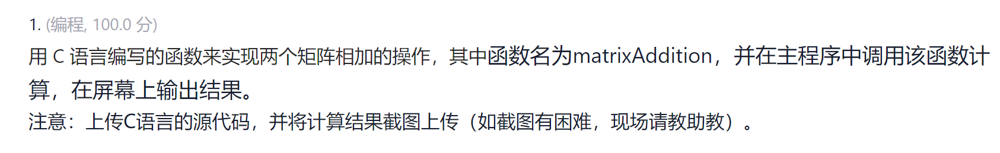

# P2



宇宙安全声明：以下代码仅在WSL2 Ubuntu-22.04, clang 14下保证通过。

## 一维数组表示二维矩阵（数组）

准确来讲，矩阵是一个数学上的概念，而非计算机科学中的概念。计算机中，数组是一连串连续的数据，可以用一个数字索引访问到其中任意一个元素。差不多是这样的：

```c
int a[20]; a[10] == *(a + 10); 
// 定义数组a，a是指向第一个元素的指针，即a类型为int *
// (a + 10)实际结果是a + 10 * sizeof(int)，即a地址加上10个整数的大小
// 然后CPU读出(a + 10 * sizeof(int))到(a + 11 * sizeof(int))（左闭右开区间）
// 之后进行比较运算。
```

如果对矩阵进行操作，我们不能凭空实现。计算机必须要有数据，才能进行对应操作。

所以问题就是，1. 如何来表示矩阵，2. 具体操作如何实现

> *Note：发现有些人有一个奇怪的思想，认为编程语言已经做好了一切我们需要的东西，不是很需要动手创造。事实上，从现实情况讲，别人不可能帮我们完成了所有事情，即使该假设成立，我们的意义就只是将这些东西Glue到一起（虽然也是Python现状），反而很少去考虑底层实现。

### 二维数组如何存储

尝试运行一下以下两行代码，看看哪行会报错：
```c
int a[2][2] = {0, 1, 2, 3};
int a[2][2] = {
        {0, 1},
        {2, 3},
    };
```

恭喜你，两行都是不报错的。虽然，第二行看上去更像矩阵，但是第一种也是可以的。


不妨观察运行时两个数组内存布局(注：只需要观察右边窗口的第一行。这里是小端存储，具体区别请必应一下(私货：不推荐百度))：


再加上一个正常的一维数组：


可以看到，C语言中二维数组是以一维数组的方式存储的。

如何理解：

规则：C存储数组是顺序存储，即每个元素都会存储到上一个元素的旁边。

- 首先，先创建一个长度为2类型为`int`的数组，然后再创建一个长度为2类型为`int(*)[2]`的数组
  *Note: 这个`int(*)[2]`不是真正的类型，只是可以表示里面存储数据的大小。具体可以回看一下上面数组是如何访问的。
- 因为每个元素都会存储到上一个元素的旁边，即：


  分为两组，0, 1和2, 3，第一组是`a[0]`，第二组是`a[1]`，然后再通过`a[x][y]`访问具体的元素。即，编译器帮你做了`*(a + x * sizeof(int[2]) + y)`的操作。
  > Note：这个操作没法编译通过，只是尽量用Cnic的方式解释一下

最后可以得出结论：

- 二维数组存储方式是一维数组，只是编译器帮你做了调用时把两个坐标转换为具体地址的工作而已。对于一维数组，你完全可以在已知`m` `n`的情况下用`a[i * n + j]`访问`i`行`j`列的元素。
- 二维数组变量的类型就是`int *a`。两层套娃可以简化为一层。

最后是一些特性：
1. 在同一函数内，`a`是一个数组，`sizeof(a)`返回整个数组的大小（字节数），即数组长度*元素大小
2. 如果这个数组作为参数传递给一个函数，那么函数中`sizeof(a)`应该是`sizeof(size_t)`，`size_t`取决于系统是32位还是64位。所以，**如果函数中需要知道数组的长度，需要函数接收一个参数表示数组长度**

#### 题外话：为什么不用变长数组

1. 不是所有编译器都支持变长数组（MSVC就不支持），并且C11标准里把这个作为编译器可选的功能，所以代码不通用

2. 容易爆栈，程序所有的变量都保存在栈上，而栈是操作系统预先分配好的有定额的内存，有些是8M，有些会更小。因为你写代码的时候并不知道这个大小是多大，往往是用户输入的。如果矩阵过大，就会导致栈溢出，大概率崩溃，也是程序漏洞。

    （经典利用案例：Minecraft老版本更新抑制器，虽然是Java，但是本质上就是爆栈引起的(分析源码可知，之所以能恢复运行，是因为mc在程序开头就会通过占用一部分栈空间，发生错误以后可以释放掉，从而恢复运行)）

3. 比定长数组慢，可能比malloc分配的数组访问快，因为CPU缓存命中率更高。但是不应该作为不使用malloc的理由，因为以上两点是硬伤。

    （你的电脑，是个赌徒，每时每刻都在赌你的条件判断和下一次要调用的内容，赌赢了，运行更快，赌输了，有几个时钟周期的惩罚（这个机制也是知名漏洞Meltdown和Spectre的BUG源头））

4. 变长数组不支持直接字面量初始化。
    > Note：字面量指的是编译期就能确定的值，比如`1`，`2`，`3`，`"abc"`等。

### 向天再乞一块地 - 向系统要一块地方存储数据（数组）

好吧，函数叫做`malloc(size_t size)`，参数是你所需要的字节数。

比如，我需要一块1024字节的内存储存256个数：
```c
// int *a = (int *)malloc(1024);
// 建议写下面这种，可以明确知道这个数组中有多少个元素
int *a = (int *)malloc(256 * sizeof(int));
```

注意：如果你不需要再用这块内存了，请记得告诉操作系统把它释放掉。

个人习惯是：哪里申请，哪里`free()`，**但是不能`free()`两次！**

语法是：`free(void *ptr)`，`ptr`是你的指针，比如`a`。

好的，新手教程已过，开始写吧！[doge]

## Solution
```c
#include <stdio.h>
#include <stdlib.h>
#define ll long long

/*按行输入矩阵*/
void scanMatrix(double *tar, ll m, ll n) {
    for (ll i = 0; i < m * n; i++) {
        // printf("scanMatrix() i = %lld", i);
        scanf("%lf", &tar[i]);
    }
}

/*
简单的矩阵加法。

这个tar可以=matrix1或者matrix2，但是矩阵乘法就不一定可以了
*/
void matrixAddition(double *matrix1, double *matrix2, double *tar, ll m, ll n) {
    for (ll i = 0; i < m * n; i++) {
        tar[i] = matrix1[i] + matrix2[i];
    }
}

int main() {
    // 定义行列数并处理输入
    int m, n;
    scanf("%d %d", &m, &n);
    // 请求内存
    double *matrix1 = (double *)malloc(m * n * sizeof(double));
    double *matrix2 = (double *)malloc(m * n * sizeof(double));
    double *res = (double *)malloc(m * n * sizeof(double));
    // 输入矩阵，矩阵加算
    scanMatrix(matrix1, m, n);
    scanMatrix(matrix2, m, n);
    matrixAddition(matrix1, matrix2, res, m, n);
    // 用完释放
    free(matrix1);free(matrix2);
    // 矩阵输出，请忽略行末的空格
    for (int i = 0; i < m; i++) {
        for (int j = 0; j < n; j++) {
            printf("%lf ", res[i * n + j]);
        }
        printf("\n");
    }
    // 用完释放
    free(res);
    // 返回0表示程序正常运行，无错误发生。
    return 0;
}

```

## Test Case

```text
10 10
40
39
84
53
97
44
72
70
50
85
30
88
71
95
6
86
97
60
87
79
89
89
25
63
34
48
23
97
30
61
16
0
37
24
96
69
87
15
23
61
3
25
20
17
62
38
22
15
17
93
74
15
6
31
92
23
76
50
9
54
99
40
38
24
89
43
81
78
39
100
76
15
36
87
2
45
49
15
59
73
48
47
66
65
35
88
9
44
65
15
66
15
38
15
17
32
75
65
80
16
80
79
81
90
75
84
53
46
84
100
96
85
91
75
72
29
51
89
17
34
43
66
32
92
29
3
64
33
19
70
66
32
61
85
46
23
31
41
12
73
8
99
24
2
91
46
75
18
39
93
31
62
81
2
95
18
84
43
71
14
6
41
6
97
83
21
94
76
51
13
20
86
14
12
55
5
63
28
35
87
25
82
93
79
92
8
97
10
39
93
28
43
76
55
7
0
96
100
49
20

```

## Output

```text
120.000000 118.000000 165.000000 143.000000 172.000000 128.000000 125.000000 116.000000 134.000000 185.000000 
126.000000 173.000000 162.000000 170.000000 78.000000 115.000000 148.000000 149.000000 104.000000 113.000000 
132.000000 155.000000 57.000000 155.000000 63.000000 51.000000 87.000000 130.000000 49.000000 131.000000 
82.000000 32.000000 98.000000 109.000000 142.000000 92.000000 118.000000 56.000000 35.000000 134.000000 
11.000000 124.000000 44.000000 19.000000 153.000000 84.000000 97.000000 33.000000 56.000000 186.000000 
105.000000 77.000000 87.000000 33.000000 187.000000 41.000000 160.000000 93.000000 80.000000 68.000000 
105.000000 81.000000 44.000000 121.000000 172.000000 64.000000 175.000000 154.000000 90.000000 113.000000 
96.000000 101.000000 50.000000 99.000000 57.000000 50.000000 112.000000 43.000000 94.000000 160.000000 
73.000000 129.000000 159.000000 144.000000 127.000000 96.000000 106.000000 54.000000 104.000000 108.000000 
94.000000 58.000000 114.000000 70.000000 24.000000 32.000000 171.000000 165.000000 129.000000 36.000000 

```