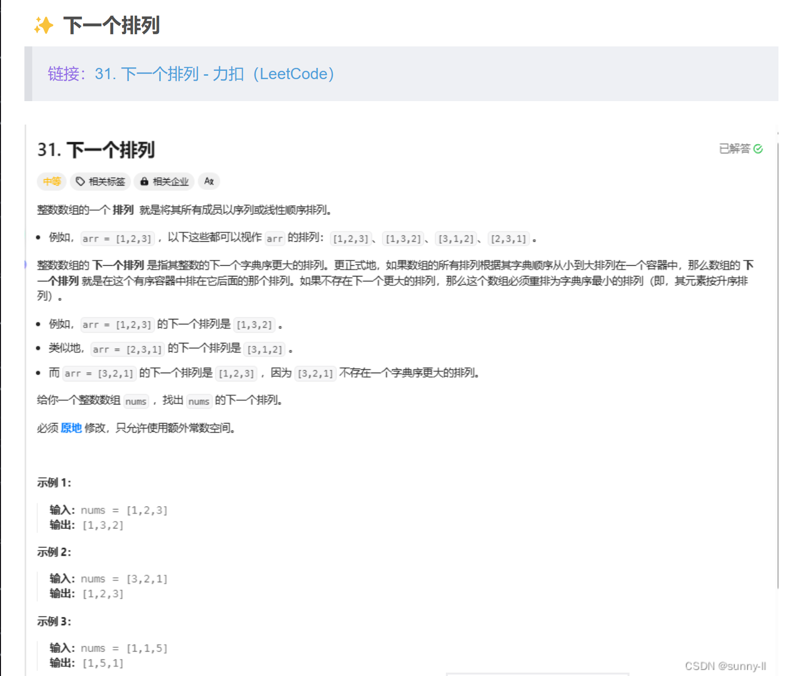
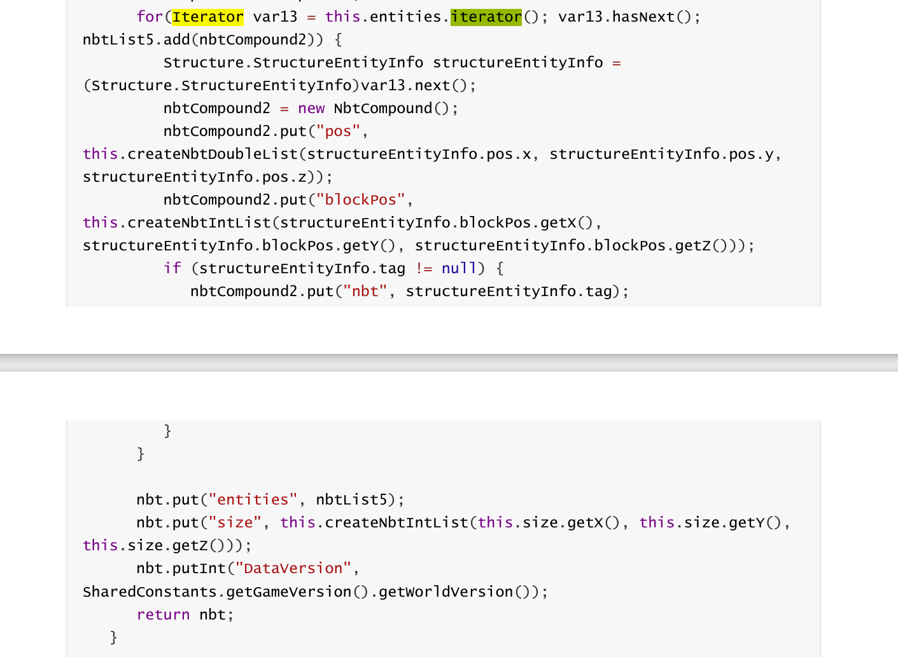

# P14

## 题目

14.设法写程序，对给定整数n，它能输出1到n的数的所有不同排列。这是一个比较困难的问题，如果希望用数组解决，请考虑下面做法：（1）为n个数的排列确定一种序。对三个数的排列，一种序是`123，132，213，231，312，321`（完全可以用其他排序）。（2）找出这种排序的规律性，设计函数`next(int a[])`，它把当时a中的排列调整为按所确定的序的下一个排列。如果这一排列存在就返回1，不存在（a里的排列已经是最后一个排列了）就返回0。这些工作完成后，程序的高层控制结构就非常简单了：

初始化a使它保存的是第一个排列：

```c
do {
    //输出a里的排列；
} while (next(a));
```

## 类似的题目



## 思路

错误的思路$\times$1：

其实我一开始想的是能不能通过移位实现。比如`n=3`的情况下，但是简单的从右往左移位本质上是和冒泡等价的，即最多有n(n-1)个答案，而本题共有n!个答案，显然不对。（但是n=3可以予人以错觉）

1. 换位的角度（群主的理解）

递归有个很好的思想，就是先大胆假设每次调用函数，都能将负责的一部分任务完成。假设一个函数`permute`可以完成`n`个元素的枚举，那么它同样可以完成`n-1`个元素的列举。不妨简化问题，我们如何去调用`permute`使其产生n个n-1个元素的排列？本质上，就是让接着的n组n-1个元素的排列都不同。这里我们不妨假设`permute`固定循环最后一个元素的可能性，并调用`permute`计算前n-1个元素的排列。

这里我们还要有一个假设：对于操作的数组`a`来说，每次`permute`做完之后都会还原上一步的数组。

于是可以得到这样的函数：
```c
void print_array(int *a, int *n); // 大家都写烂了所以不写了
void swap(int *a, int *b) {
    int tmp = *a;
    *a = *b;
    *b = tmp;
}

void _permute(int *a, int n, int total) {
    // stop condition
    if (n == 0) {
        print_array(a, num);
        return;
    }
    int *end = n - 1;
    for (int i = 0; i < n; i++) {
        swap(&a[i], end);
        _permute(a, n-1, total);
        swap(&a[i], end);
    }
}

// entry
void permute(int n) {
    int *a = (int *)malloc(n * sizeof(int));
    for (int i = 0; i < n; i++) {
        a[i] = i + 1;
    }
    _permute(a, n, total);
}
```

2. 搜索的角度

暴力枚举每一位的元素，然后判断一下这一位是否被前一位所用。在复杂度上，这个思路至少会比前面多一个C*n^2的操作，而且，（其实这两种是不符合题目要求的）。

```c
void print_array(int *a, int cnt);

void func114514(int *a, int *idx, int cnt, int idx_idx) {
    // stop condition
    if (idx_idx == cnt) {
        // count += 1;
        print_array(idx, cnt);
        return;
    }
    // enumerate all possible combination of this position(check if it is used
    // before), then use itself to enumerate the next position.
    for (int i = 1; i <= cnt; i++) {
        if (a[i] == 0) { // not using 1 because it's hard
            a[i] = 1;
            idx[idx_idx] = i;
            func114514(a, idx, cnt, idx_idx + 1);
            a[i] = 0;
            // idx[idx_idx] does not need to be reset cuz it will be overwrite.
        }
    }
}

// entry(shadow the detail of the recursion)
void permute(int n) {
    int *a = (int *)malloc((2 * n + 1) * sizeof(int));
    for (int i = 0; i < 2 * n + 1; i++) {
        a[i]  = 0;
    }
    int *idx = a + n + 1;
    func114514(a, idx, n, 0);
}
```

3. 符合题目一点

如果要用上`do {;} while (next(a));`的话，这就是一个典型的迭代器的设计模式（但是由于C的）。举一段yarn反编译的1.16.5mc代码为例（注：Java大部分语法与C和C++并无区别）：



题目里要求设计的`next(a)`直接返回状态码，等效于上面的`xxx.hasNext()`。

这个显然需要一点额外的变量储存变量。

基本可以猜到是
```c
void print_array(int *, int);

void permute(int n) {
    int *a = (int *)malloc(n * sizeof(int));
    for (int i = 0; i < n; i++) {
        a[i] = i + 1;
    }
    do {
        print_array(a);
    } while (next(a));
}
```

这里涉及到字典序的问题。简单而言字典序就是指前一个比后一个大。

对于一串数据而言，每一位按照非逆序排列是最小，而这个规律是可以放到局部进行比较的，即天生具有递归性。

由此，如果非逆序结束位置越靠前，则它的排列靠后

所以字典序的思想就是：对于某一位，从小到大依次取元素排列，并在后面生成一个从小到大的排列，然后再对下一位进行处理。(其实就是dfs)

本质上来讲，字典序的实现dfs。这是因为dfs由于loop是从1 -> n的，所以dfs天生就是按照字典序遍历的。如果dfs的loop是从n -> 1的话，那么遍历顺序就是反向的字典序。

```c
// 实现，纯粹盯着结果盯出来的，[实际上可以用partial的dfs来实现](存疑)
// 这里采用dfs的输出的模式，只用swap()
// `n` 变量不得不加，毕竟总不能用全局变量吧（虽然不是不行）
// 有点故意给自己加难度之嫌，说实话规律都是盯出来的
// 至少保证了线性复杂度
int next(int *a, int n) {
    // 判断位置，从后往前第一个不符合降序排列的前一个是目前正在处理的位置
    int last = predicate_desc_r2l(a, n);
    if (last == -1) {
        return 0;
    }
    // 寻找最小的大于当前处理的位置保存的数的数
    int k = n - 1;
    while (a[k] < a[last]) {
        k--;
    }
    // 交换位置
    swap(&a[k], &a[last]);
    // 使(last, n)升序（本来已降序）
    int i = last + 1, j = n - 1;
    // [last+1, n) is dscending
    while (i < j) {
        swap(&a[i], &a[j]);
        i++;
        j--;
    }
    return 1;
}
```